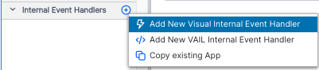

# Hello World Tutorial

## Objectives
This guide is to take a new Vantiq user to the minimum set of steps required to create an event-driven application on the Vantiq platform.

## Tutorial Overview
In this tutorial, the developer accomplishes two basic tasks:
* Simulate events
* Ingest and process those events

## Step 1: Start a New Project
While not strictly necessary, let's make sure we're building our application from scratch.  If you're already seeing a popup asking about what kind of project you'll be making, skip ahead in these instructions to the popup that you're seeing.
1. From the *Projects* menu on the Nav Bar, choose New Project.  Click the radio button for *Add Project* in the New Project pop-up, then click *Continue*.

2. Choose *Empty* for the Project Wizard popup choice, and click *Continue*


3. Finally, give your project a name, and click *Finish*


## Step 2: Create a Topic
Topics are a way to send events within the Vantiq platform.  We're going to create a Topic to simulate events that our Service can ingest and process.
1. Choose Add -> Advanced -> Topic in the Nav Bar.


2. Click *+ New Topic* in the New Topic popup


3. Name: */Hello*
4. Package: *hello.world*
5. Ignore the rest for now, and click *OK*


You've now made a Topic, which we'll use to send events to our Service for processing.  Leave this pane up for now.


## Step 3: Create a Service
Services in Vantiq work much like classic micro services, but with some special characteristics to make them more event-driven and stateful.  We're going to create our own Service to take in and apply logic to the events sent from our Topic. 
1. From the Nav Bar Add menu, choose *Service...*, then click on *+ New Service*
2. Name: *HelloSvc*
3. Package: Select *hello.world* from the drop-down, and click OK


Your workspace in the IDE is now a Topic and a Service side-by-side.  These are all we need to make our application.

## Step 4: Configure the Service to take Topic Events
1. Click on the Implement tab at the top left of the Service.


2. Click on the *+* next to internal Event Handlers, and select the *Add New Visual Internal Event Handler* option



3. Name: *HelloHandler*, then click OK


The first Activity Task to appear in the Visual Event Handler is labeled *Initiate* and it is an EventStream task to ingest events.  Click on it to select it and a menu will slide in from the right side.


4. Next to *Configuration*, click *Click to Edit*
5. inboundResource: Select *topics* from the drop-down
6. inboundResourceId: Select */hello.world/Hello*, then Click OK


7. Save the Service to apply the changes


## Step 5: Apply Logic to the EventStream
Visual Event Handlers let developers apply application logic requiring little or no code, just by dragging pre-built code blocks called Activity Patterns into the visual event flow.  We're going to add an activity task now.
1. From the Actions submenu, click and drag a LogStream pattern onto the Initiate task. 


Upon release, LogStream will appear downstream from Initiate.


2. Click on the LogStream task, and then *Click to Edit* to configure it
3. Choose the *Info* log level from the drop-down, then click OK
4. Save the Service

## Step 6: Make Log Messages Visible
At the bottom of the IDE is a panel for seeing Errors, Log Messages and Autopsies (for debugging). Click on the drop-down and make sure that *Log Messages* is toggled on.


## Step 7: Test the Hello World Application
We've got everything in place: A topic for sending an event, a Service listening for that event, and logic to log the message received.  Let's verify that our application works!

1. In the Publish Message pane in the Topic window, write a JSON-formatted message.  Example:

```
{
    "bread" : "white",
    "loaves" : 7
}
```

2. Click the *Publish* button
3. You should see red event badges on the Activity Tasks in the Visual Event Handler in the Service:


And in the Log Messages panel at the bottom of the IDE, you should see the logged message:


## Conclusion
Congratulations!  You've created your first event-driven application on the Vantiq platform, and you didn't have to write a single line of code!  Most of the time, you won't even need to create a Topic; Vantiq takes in events through integrations with anything that exists in the Internet. 

Services take in asynchronous inputs, apply logic to them as the application requires, and outputs the results, sometimes to other Services for further processing.

Application logic can be applied visually, using Activity Patterns that are configured into tasks that are shown as part of the event processing flow.  Code can be inserted at any point in the application, using Vantiq's proprietary language, VAIL.

## Where to Learn More
Vantiq provides a suite of Tutorials and Documentation on all different development topics.  Just click on the *Help* button on the Nav Bar and choose *Developer Guides*.  Develper discussions and forums are available on Vantiq's [Community Portal](https://vantiq.community.com).